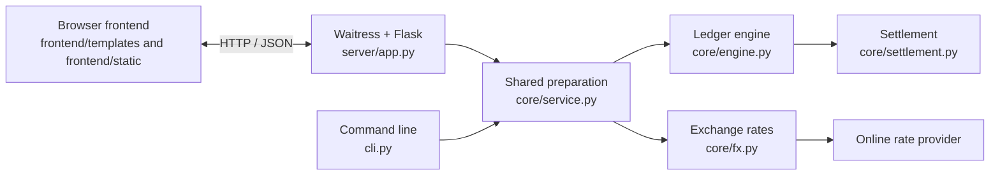
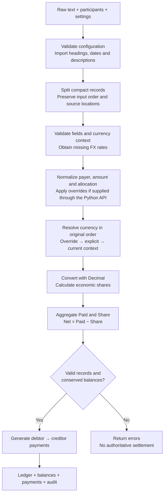

## Server architecture

Trip Split has three boundaries: the browser frontend, the Python HTTP server,
and the shared ledger core. The command-line interface uses the same core.

The browser collects notes, participants, the default split, the final currency,
and optional rate settings. A text upload is read in the browser and submitted
as part of the same JSON request as pasted notes. JavaScript displays results
and supports filtering, copying payments and downloading the audit; it does not
calculate financial values.

`server/app.py` serves these routes:

| Route | Responsibility |
| --- | --- |
| `GET /` | Render the application template. |
| `GET /static/...` | Serve packaged scripts, styles, fonts, logo and example. |
| `POST /api/calculate` | Validate a JSON request, invoke the core and return audit data and formatted display values. |
| `GET /health` | Confirm the application responds; this is not an FX-provider readiness check. |

The server translates request fields into `LedgerOptions`. `core/service.py`
validates the participant registry and rates, checks the raw stream, obtains
missing rates and invokes `LedgerEngine`. The CLI calls the same preparation
function and engine. The engine itself never performs network requests.

The successful response contains exact decimal strings in `audit` and
Python-formatted values in `display`. `report.py` owns monetary display
formatting. Invalid input produces an error response with no payment plan.

Requests run synchronously in Waitress's four threads. The server limits request
size, checks supplied origins, validates configured hostnames and uses
a self-only content security policy. It binds to `127.0.0.1:8000` by default;
`--port` changes the port. The separate manual deployment profile allows the
configured public hostname, trusts HTTPS forwarding only from the loopback
connector and limits concurrent calculations. The [deployment plan](../deployment/README.md)
covers public routing and manual supervision without login/boot startup.

There is no database, account system or background calculation queue. Notes are processed
in request memory and remain in the browser until cleared or the page is
reloaded. Exchange rates are not cached or written to disk. Each calculation
fetches each missing currency pair once from the Frankfurter ECB feed and keeps
it in that calculation's configuration. Only currency codes and dates go to the
provider; the audit records the rate, requested date, published date and retrieval
time. Manual rates avoid network access when all required pairs are supplied.
There is no shared FX state or cache lock. The installed profile writes private
operational logs, not expense notes.

## Parser and calculation flow

Preparation and calculation are separate passes. Preparation discovers required
currencies and loads rates. Calculation resolves the normalized ledger and
economic balances using the resulting configuration.

1. **Validate inputs.** Participants, aliases, currencies, rates and default
   allocation are configuration data. Participant codes are single ASCII letters;
   uppercase `A` is reserved for everyone. FX equations work in either direction,
   but each must include the base currency and use a positive, finite rate.

2. **Import the document.** `core/parser.py` reads a trip heading, date headings
   and merchant descriptions without sorting expenses. Every transaction keeps
   its original source text, line, sequence and character span. Unrecognized
   nonempty content is retained for validation rather than silently discarded.

3. **Split and parse records.** Multiple expenses on one line work with or without
   separators. Payer codes must match the configured registry. The parser checks
   complete interpretations of the record stream; ambiguous records are errors,
   not guesses. Amount, explicit currency and allocation are separate fields.

4. **Check currency context and prepare rates.** The service scans expenses in
   original input order. An explicit currency establishes a new context; an
   unlabelled record inherits the current context. An optional starting currency
   establishes the initial context. Without either, an unlabelled first expense
   is an error before any rate lookup. Missing rates use an explicit rate date or
   the latest calendar date inferred from document headings. Choosing the FX date
   does not reorder records. Each missing pair is fetched once per calculation;
   provider results retain provenance in the audit.

5. **Normalize effective fields.** `core/engine.py` resolves payer codes to stable
   participant IDs, validates amounts and normalizes allocations. `A` splits
   equally among all active participants; a participant suffix allocates 100% to
   that person; multiple distinct participant letters split equally among those
   people; no suffix uses the configured default split. Payer and economic
   bearer are independent. Separate overrides take priority when supplied to the
   Python API; the web form and simple CLI do not expose an override editor.

6. **Resolve currency state.** The engine walks the original sequence using
   override, explicit currency, current context, then unknown. An override normally
   changes subsequent context; its explicit one-transaction mode does not.
   Currency sources record `override`, `explicit`, `initial_config`, `inherited`
   or `unknown`. The direct engine API can retain unknown currencies for auditing;
   they block settlement. Currency is never inferred from amount, merchant or trip.

7. **Convert and allocate.** Each resolved amount is multiplied by its configured
   base-per-unit FX rate. Shares use the normalized allocation and its weights.
   Decimal calculations avoid rounding each transaction to display precision.

8. **Aggregate and validate.** Paid is the amount each person fronted; Share is
   their economic responsibility. Net is Paid minus Share: positive receives,
   negative pays. The engine checks total Paid and Share against total expense,
   and verifies that total Net is zero within the configured tolerance. Duplicate
   transaction IDs, invalid records or failed invariants block settlement; balances
   are never adjusted merely to force conservation.

9. **Settle and report.** `core/settlement.py` receives only net balances and a
   tolerance. A deterministic greedy algorithm pairs debtors with creditors.
   Reports include transactions, economic shares, balances, payments and currency
   segments. The web audit also preserves configuration, rate provenance, the full
   input and its SHA-256 fingerprint. Rounding occurs only in display formatting;
   audit amounts remain decimal strings.
